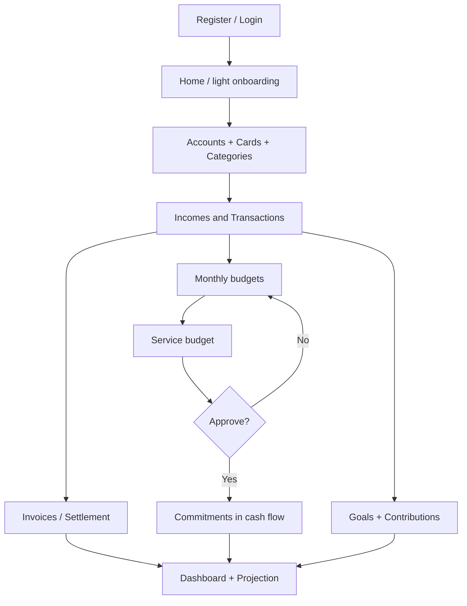

# NutriGrana

Personal finance management MVP: income and expense tracking, bank accounts, credit cards, budgets, goals, and cash-flow forecasting.

Core stack: **Laravel 12 + Inertia.js + Vue 3 + MySQL/SQLite + Tailwind CSS**.

---

## Problem and MVP proposal

Individuals need a single place to track money in and out, follow credit card invoices, plan spending, and check whether goals fit the budget — without fragmented spreadsheets.

The MVP covers that full cycle:

1. Authenticate and set up the profile
2. Register accounts, cards, and categories
3. Record incomes and transactions (one-off and recurring)
4. Track invoices and settle payments
5. Define budgets and goals with contributions
6. Review financial health on the dashboard (with projection)

---

## MVP features

### Authentication and account
- Register, login, logout (Laravel Breeze + session)
- Email verification and password recovery
- User profile (data, photo, account deletion)
- Password change via email code + throttle
- Absolute session timeout (`SESSION_ABSOLUTE_LIFETIME`)

### Accounts and cards
- Bank account CRUD (types, balance, usage toggles)
- Credit card CRUD (brand, limit, archival)
- Invoices per card: list, detail, and settlement

### Categories
- CRUD with hierarchy (parent/child)
- Types (income/expense), archival
- Default categories on domain onboarding

### Incomes and transactions
- Recurring incomes with automatic transaction generation
- Income/expense transactions by month
- Recurrence (parent → occurrences materialized on demand)
- Statuses (pending, forecasted, paid, etc.)
- Income confirmation and links to account/card/category
- Card payments integrated with invoices

### Budgets
- Monthly budget by category (progress and overspend checks)
- Service budget (quote → approve/reject) with financial viability
- Commitments projected into cash flow when a service is approved

### Financial goals
- Goals with target amount and deadline
- Contributions (progress and pace)
- Goals widget on the dashboard

### Dashboard and forecasts
- On-demand widgets: summary, accounts, cards, categories, income×expense, goals
- Periods (current / historical)
- Cache by user + period + widgets
- Cash-flow projection (up to 12 months) from balance + forecasted items

---

## Stack and role of each piece

| Layer | Technology | Why |
|-------|------------|-----|
| Backend | PHP 8.2 + Laravel 12 | Mature ecosystem, Policies, Form Requests, Eloquent |
| Auth | Laravel Breeze (session) | Fast authenticated MVP, native CSRF and session |
| SPA bridge | Inertia.js | Reactive UI without a separate REST API in the MVP |
| Frontend | Vue 3 + Vite | Component model; Vite for hot reload |
| UI | Tailwind CSS + Heroicons | Visual consistency without scattered CSS |
| Charts | ApexCharts (vue3-apexcharts) | Dashboard charts |
| Feedback | vue3-toastify | Feedback for CRUD actions |
| Persistence | MySQL (prod) / SQLite (default local) | `decimal` for money; versioned migrations |
| Quality | Pint, PHPUnit, Model::shouldBeStrict (non-prod) | Formatting and early failure on N+1/lazy loading |

---

## Architecture and decision-making

### Layers

```
Browser (Vue + Inertia)
        ↓
Route (auth + throttle)
        ↓
Controller (thin) → authorize via Policy
        ↓
Form Request (validation)
        ↓
Service (business rules, orchestrates repos, cache, events)
        ↓
Repository (Eloquent queries)
        ↓
Model (relations, casts, scopes) + Migration
        ↓
API Resource / Inertia props (never return a raw Model)
```

### Conscious MVP decisions

| Decision | Rationale |
|----------|-----------|
| Thin controllers + Services | Rules (recurrence, invoices, projection) do not belong in controllers |
| Repositories | Isolate queries; keep Services readable and testable |
| Policies on every resource | Ownership: users only access their own data |
| Form Requests | Validation outside controllers; centralized messages and authorize |
| API Resources | Stable contract for the Inertia frontend |
| PHP Enums | Avoid magic strings (`SituacaoLancamento`, `TipoOrcamento`…) |
| `decimal` in the database | Money without float |
| Encrypted route keys | Sequential IDs do not leak in URLs |
| Lazy recurrence materialization | Generate occurrences when opening a month/dashboard, no heavy batch job in the MVP |
| Dashboard cache | Expensive aggregations; key by user/period/widgets |
| Inertia instead of API + SPA | One deploy, one session auth; public API left for phase 2 |
| Service budget with viability | Differentiator: decide whether a spend fits projected cash flow |

### Security (MVP)

- Policy-based authorization on each domain
- Throttle on login, reset, and password change
- Session lifetime + absolute timeout
- Ownership checks in Services
- Escaping via Vue/Inertia; controlled mass assignment on Models
- `Model::shouldBeStrict` outside production

---

## Full MVP flow (user journey)



**End-to-end request example (create transaction):**

1. Vue sends `POST /lancamentos` via Inertia/axios
2. `CriarLancamentoRequest` validates the payload
3. `LancamentoController` authorizes and calls `LancamentoService`
4. Service applies rules (account/card, recurrence, invoice if card)
5. `LancamentoRepository` persists
6. Resource / Inertia redirect refreshes the month view

---

## Code domains

```
app/
  Http/Controllers|Requests|Resources|Middleware
  Services/          # rules (Lancamento, Dashboard, Orcamento, Financeiro…)
  Repositories/      # queries
  Models/            # per domain
  Policies/          # ownership
  Enum/              # domain typing
  Support/           # value objects, cache keys, menu
resources/js/Pages/  # Inertia screens (Vue)
database/migrations/ # versioned schema
```

Main modules: `Usuario`, `ContaBancaria`, `CartaoCredito`, `FaturaCartao`, `Categoria`, `Renda`, `Lancamento`, `Orcamento` / `OrcamentoServico`, `Objetivo`, `Dashboard`.

---

## Getting started

**Requirements:** PHP 8.2+, Composer, Node 18+, MySQL (or SQLite).

```bash
composer setup
# or manually:
cp .env.example .env
composer install
php artisan key:generate
php artisan migrate
npm install && npm run build
php artisan serve
npm run dev   # in another terminal for HMR
```

Optional (project script): `composer dev` starts server + queue + logs + Vite.

---

## Out of MVP scope (next steps)

- REST/token API for mobile
- Jobs/queues to materialize recurrences in batch
- Multi-currency / Open Finance
- Feature tests covering critical Services
- Observability (cache hit metrics, dashboard latency)

---
